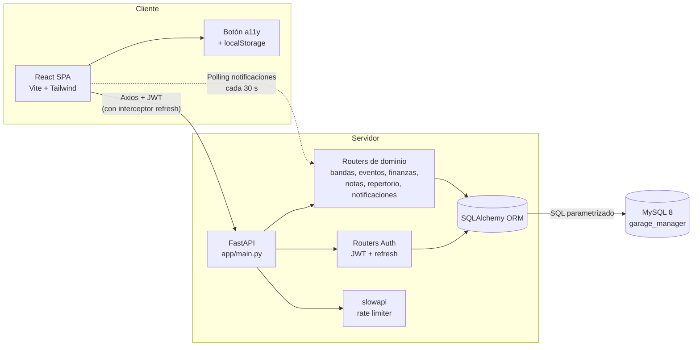
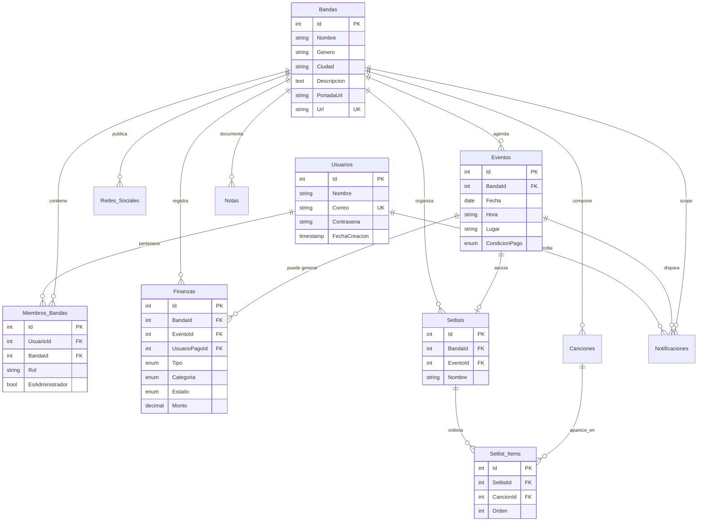

# Garage Manager — Informe técnico del MVP

> Documento de cierre de la **penúltima fase** del proyecto.
> Recolecta las evidencias tangibles del avance en frontend, backend y base de datos, junto con la reflexión crítica del equipo sobre el ciclo de vida del desarrollo.

### Criterio de evaluación (docente)

> *«Asimismo, se incluyen **evidencias tangibles** del progreso técnico alcanzado en el **frontend**, **backend** y **diseño de la base de datos**, junto con una **reflexión crítica** sobre los **aprendizajes adquiridos** y las **dificultades enfrentadas** durante el proceso. De esta manera, el informe tiene como propósito documentar de forma estructurada y profesional el **ciclo de vida** del desarrollo del software planteado por el equipo, desde su **conceptualización** hasta la implementación de un **MVP funcional** al cierre del semestre.»*

| Exigencia | Dónde se atiende en este documento |
|-----------|-----------------------------------|
| Evidencia **frontend** | §6 (identidad, componentes, a11y, quick wins) y **fragmentos reales** en §6.5–6.6 |
| Evidencia **backend** | §5 (endpoints, autenticación, balance, tests) y **fragmentos reales** en §5.2 |
| **Diseño de la BD** | §4 (ER, decisiones, migraciones) y **fragmento SQL** en §4.4 |
| **Reflexión crítica** (aprendizajes y dificultades) | §8 |
| **Ciclo de vida** (concepto → MVP) | §1, §9 y §10 |

---

## 1. Conceptualización del producto

### 1.1 Problema observado

Las bandas independientes coordinan eventos, finanzas, repertorio y miembros a través de canales informales (WhatsApp, hojas de cálculo dispersas, notas de voz). Esto genera tres problemas recurrentes:

1. **Pérdida de información**: cambios de hora/lugar que no llegan a todos los miembros.
2. **Falta de trazabilidad financiera**: los reembolsos y cobros parciales se olvidan, generando conflictos internos.
3. **Imagen pública fragmentada**: cada miembro comparte por su cuenta los datos de contacto y enlaces a redes, sin un punto único.

### 1.2 Propuesta de valor del MVP

**Garage Manager** es una aplicación web multi-banda que centraliza:

- Perfil de la banda (interno y público).
- Gestión de miembros con roles y permisos.
- Calendario de eventos con notificaciones automáticas.
- Registro financiero con balance individual y por banda.
- Notas internas colaborativas.
- Repertorio (canciones + setlists asociados a eventos).

El MVP entregado al cierre del semestre cubre todos los requerimientos funcionales del documento de planeación y suma diferenciadores propuestos en la fase de quick wins.

### 1.3 Alcance del MVP

| Incluido en MVP | Fuera del alcance del MVP |
|---|---|
| Autenticación con JWT + refresh tokens | App móvil nativa |
| Multi-banda por usuario | Pasarela de pagos integrada |
| CRUD completo de eventos, finanzas, notas, repertorio | Mensajería interna en tiempo real |
| Perfil público de la banda con rate limiting | Despliegue productivo (queda como trabajo futuro) |
| Notificaciones internas (campanita) | Notificaciones push/email |
| Accesibilidad básica (a11y) | Internacionalización (i18n) |

### 1.4 Alineación con el informe de la asignatura (requisitos funcionales clave)

| Tema en el documento de proyecto | Evidencia en el código y en este informe |
|----------------------------------|------------------------------------------|
| Registro e inicio de sesión de usuarios | `backend/app/routers/auth.py`, `frontend/src/pages/Login.jsx` y `Registro.jsx` |
| Gestión de banda(s), miembros, roles, administración | `bandas.py`, `BandaContext.jsx`, `Banda.jsx` |
| Perfil interno y URL pública de la banda | `PerfilPublico.jsx`, `GET /bandas/publico/{url}` |
| Redes sociales con validación de enlaces | `utils/redes.js`, endpoints de redes en `bandas` |
| Eventos (CRUD) y notificaciones asociadas | `eventos.py`, `services/notificaciones.py`, `Eventos.jsx`, `CampanaNotificaciones.jsx` |
| Finanzas: ingresos/gastos, estados, balance | `finanzas.py`, `Finanzas.jsx` |
| Notas internas | `notas.py`, `Notas.jsx` |
| Repertorio: canciones y setlists | `repertorio.py`, `Repertorio.jsx` |
| Base de datos relacional e integridad | `schema.sql`, `migrations/`, §4 de este documento |
| Pruebas automatizadas | `tests/`, §5.3 y §7 de este documento |

---

## 2. Stack tecnológico y justificación

| Capa | Tecnología | Justificación |
|---|---|---|
| Frontend | **React 19 + Vite 7** | SPA reactiva con HMR inmediato. Vite mantiene el build de producción en pocos segundos. |
| Estilos | **Tailwind CSS 4** | Sistema de diseño basado en utilidades; permitió aplicar la identidad visual nueva (paleta `#E60000` / `#FF8800` / `#FF5757` y tipografía League Spartan) en cuestión de minutos. |
| Routing | **react-router-dom 7** | Estándar de facto, soporte completo para rutas anidadas y redirecciones protegidas. |
| HTTP | **Axios** con interceptor de refresh | Permite manejar reintentos transparentes ante respuestas `401` sin tocar cada llamada. |
| Iconografía | **lucide-react** | Set extenso, tree-shakeable, se integra como componentes React. |
| Backend | **FastAPI** (Python 3.11) | Tipado fuerte vía Pydantic, generación automática de OpenAPI, async-ready. Ideal para la curva de aprendizaje del equipo. |
| ORM | **SQLAlchemy 2** | Permite mapear el modelo relacional con código Python idiomático y mantener migraciones explícitas en SQL crudo. |
| Base de datos | **MySQL 8 / MariaDB** (XAMPP) | Coincide con el stack del laboratorio universitario y soporta `ENUM`, `TIMESTAMP ON UPDATE` y FK con `ON DELETE`. |
| Auth | **JWT (HS256)** + `bcrypt_sha256` | Sin estado en el servidor, fácil de testear y de revocar mediante expiración corta + refresh. |
| Rate limiting | **slowapi** | Middleware compatible con FastAPI; protege login y perfil público contra abusos. |
| Testing | **pytest + httpx + SQLite in-memory** | Suite hermética, repetible (~10 s), sin dependencia de MySQL local. |

---

## 3. Arquitectura del sistema

### 3.1 Diagrama de arquitectura



### 3.2 Estructura de carpetas

```
GarageManager/
├── backend/
│   ├── app/
│   │   ├── config.py              # variables de entorno y constantes
│   │   ├── database.py            # engine + SessionLocal + Base
│   │   ├── models.py              # 11 modelos SQLAlchemy
│   │   ├── schemas.py             # contratos Pydantic (request/response)
│   │   ├── security.py            # hashing + JWT (access/refresh)
│   │   ├── rate_limit.py          # Limiter compartido (slowapi)
│   │   ├── main.py                # entrypoint FastAPI + middlewares
│   │   ├── services/
│   │   │   └── notificaciones.py  # generación auto de notificaciones
│   │   └── routers/
│   │       ├── auth.py
│   │       ├── bandas.py
│   │       ├── eventos.py
│   │       ├── finanzas.py
│   │       ├── notas.py
│   │       ├── repertorio.py
│   │       ├── notificaciones.py
│   │       └── deps.py            # validar_admin / validar_miembro
│   ├── migrations/                # 4 scripts SQL versionados
│   ├── tests/                     # 30 tests con pytest
│   ├── scripts/reset_db.py        # utilitario para entornos de prueba
│   └── schema.sql                 # esquema completo para instalación limpia
└── frontend/
    └── src/
        ├── api/                   # 7 clientes Axios por dominio
        ├── components/            # Layout, Modal, Logo, BotonAccesibilidad...
        ├── context/               # BandaContext (banda activa global)
        ├── pages/                 # 9 páginas (Login, Dashboard, Banda, ...)
        ├── utils/                 # formato, redes, export CSV/PDF
        └── index.css              # tema (Tailwind @theme + a11y)
```

---

## 4. Base de datos

### 4.1 Modelo entidad-relación



### 4.2 Decisiones de diseño relacional

- **Normalización 3FN** en todas las tablas. No hay datos derivados almacenados (el balance, por ejemplo, se calcula en tiempo de consulta para evitar inconsistencias).
- **`ON DELETE CASCADE`** en relaciones de propiedad fuerte (`Bandas → Miembros_Bandas`, `Setlists → Setlist_Items`): borrar la banda elimina su contenido derivado.
- **`ON DELETE SET NULL`** en relaciones débiles (`Eventos → Finanzas.EventoId`): permite borrar un evento sin perder el histórico financiero asociado.
- **`ON DELETE RESTRICT`** en `Usuarios → Miembros_Bandas`: protege la integridad histórica; un usuario no puede eliminarse si todavía pertenece a una banda.
- **`ENUM` nativos de MySQL** para `CondicionPago`, `Tipo`, `Categoria`, `Estado` y `Tipo` de notificaciones: validación a nivel base + alineación con los `Literal` de Pydantic en backend.
- **Índices secundarios** en `Canciones.BandaId`, `Setlists.BandaId`, `Setlists.EventoId`, `Setlist_Items.SetlistId` para acelerar las consultas más frecuentes (listados por banda).
- **`UNIQUE KEY` compuesta** `uniq_usuario_banda` (UsuarioId, BandaId) para garantizar a nivel BD que un usuario no se duplica como miembro de la misma banda.

### 4.3 Estrategia de migraciones

Las migraciones viven en `backend/migrations/` y se aplican manualmente en orden numérico:

| Archivo | Propósito |
|---|---|
| `001_esquema_completo.sql` | Bootstrap inicial (todas las tablas base). |
| `002_fix_tablas_nuevas.sql` | Ajustes correctivos a tipos de datos detectados durante pruebas. |
| `003_fix_notificaciones_tipo.sql` | Modificación del `ENUM` de `Notificaciones.Tipo` para soportar nuevos eventos. |
| `004_repertorio_setlists.sql` | Incorporación del módulo de repertorio (canciones, setlists, setlist_items). |

`backend/schema.sql` mantiene el esquema **agregado y consolidado** para instalaciones limpias en entornos nuevos.

### 4.4 Fragmento SQL — integridad y unicidad (evidencia en código)

Inclusión del `UNIQUE` compuesto que impide duplicar un mismo usuario en una banda (coherente con el modelo ORM y con los requisitos de membresía):

```sql
CREATE TABLE IF NOT EXISTS Miembros_Bandas (
    Id INT PRIMARY KEY AUTO_INCREMENT,
    UsuarioId INT NOT NULL,
    BandaId INT NOT NULL,
    Rol VARCHAR(80) NOT NULL,
    EsAdministrador TINYINT(1) NOT NULL DEFAULT 0,
    FechaIngreso TIMESTAMP DEFAULT CURRENT_TIMESTAMP,
    UNIQUE KEY uniq_usuario_banda (UsuarioId, BandaId),
    FOREIGN KEY (UsuarioId) REFERENCES Usuarios(Id) ON DELETE RESTRICT,
    FOREIGN KEY (BandaId) REFERENCES Bandas(Id) ON DELETE CASCADE
) ENGINE=InnoDB;
```

(Fuente: `backend/schema.sql`, tabla `Miembros_Bandas`.)

---

## 5. Backend — evidencias técnicas

### 5.1 Inventario de endpoints REST

| Método | Ruta | Auth | Descripción |
|---|---|:---:|---|
| POST | `/auth/registro` | — | Crear usuario |
| POST | `/auth/login` | — | Login (rate-limited) |
| POST | `/auth/refresh` | refresh | Renueva par de tokens |
| GET | `/auth/me` | access | Datos del usuario autenticado |
| POST | `/bandas/` | access | Crear banda (creador queda como admin) |
| GET | `/bandas/mias` | access | Listar bandas del usuario |
| PUT | `/bandas/{id}` | admin | Editar perfil de la banda |
| GET | `/bandas/{id}/miembros` | miembro | Listar miembros |
| POST | `/bandas/{id}/miembros` | admin | Invitar miembro |
| DELETE | `/bandas/{id}/miembros/{mid}` | admin | Quitar miembro |
| GET | `/bandas/{id}/redes` | miembro | Listar redes |
| POST | `/bandas/{id}/redes` | admin | Agregar red social |
| DELETE | `/bandas/{id}/redes/{rid}` | admin | Eliminar red social |
| GET | `/bandas/publico/{url}` | público | Perfil público (rate-limited) |
| POST | `/eventos/` | miembro | Crear evento + notificaciones |
| GET | `/eventos/banda/{id}` | miembro | Listar eventos de una banda |
| PUT | `/eventos/{id}` | miembro | Editar evento |
| DELETE | `/eventos/{id}` | miembro | Eliminar evento |
| POST | `/finanzas/` | miembro | Crear movimiento |
| GET | `/finanzas/banda/{id}` | miembro | Listar movimientos |
| PUT | `/finanzas/{id}` | miembro | Editar movimiento |
| DELETE | `/finanzas/{id}` | miembro | Eliminar movimiento |
| GET | `/finanzas/banda/{id}/balance` | miembro | Balance global y por miembro |
| POST | `/notas/` | miembro | Crear nota |
| GET | `/notas/banda/{id}` | miembro | Listar notas |
| PUT | `/notas/{id}` | miembro | Editar/fijar nota |
| DELETE | `/notas/{id}` | miembro | Eliminar nota |
| POST | `/repertorio/canciones` | miembro | Crear canción |
| GET | `/repertorio/bandas/{id}/canciones` | miembro | Listar canciones |
| PUT | `/repertorio/canciones/{id}` | miembro | Editar canción |
| DELETE | `/repertorio/canciones/{id}` | miembro | Eliminar canción |
| POST | `/repertorio/setlists` | miembro | Crear setlist |
| GET | `/repertorio/bandas/{id}/setlists` | miembro | Listar setlists |
| GET | `/repertorio/setlists/{id}` | miembro | Detalle de setlist |
| GET | `/repertorio/eventos/{id}/setlist` | miembro | Setlist de un evento |
| PUT | `/repertorio/setlists/{id}` | miembro | Editar setlist |
| DELETE | `/repertorio/setlists/{id}` | miembro | Eliminar setlist |
| GET | `/notificaciones/` | access | Listar notificaciones del usuario |
| POST | `/notificaciones/{id}/leer` | access | Marcar como leída |
| POST | `/notificaciones/leer-todas` | access | Marcar todas como leídas |

> Total: **39 endpoints** documentados automáticamente en `/docs` (Swagger UI generado por FastAPI).

### 5.2 Snippets de código clave

**Hashing seguro de contraseñas** (`backend/app/security.py`):

```python
from passlib.context import CryptContext

pwd_context = CryptContext(schemes=["bcrypt_sha256", "bcrypt"], deprecated="auto")

def hash_password(password: str) -> str:
    return pwd_context.hash(password)

def verify_password(plain_password: str, hashed_password: str) -> bool:
    return pwd_context.verify(plain_password, hashed_password)
```

`bcrypt_sha256` evita el límite de 72 bytes del bcrypt puro; se mantiene `bcrypt` en la lista para compatibilidad con hashes antiguos si los hubiera.

**Tokens duales (access + refresh)** (`backend/app/security.py` — implementación real con `python-jose` y fechas en UTC):

```python
from jose import jwt
from datetime import datetime, timedelta, timezone
# SECRET_KEY y ALGORITHM vienen de app.config

def _build_token(subject: str, expires_delta: timedelta, token_type: str) -> str:
    expire = datetime.now(timezone.utc) + expires_delta
    payload = {"sub": subject, "exp": expire, "type": token_type}
    return jwt.encode(payload, SECRET_KEY, algorithm=ALGORITHM)

def create_access_token(subject: str) -> str:
    return _build_token(
        subject, timedelta(minutes=ACCESS_TOKEN_EXPIRE_MINUTES), token_type="access"
    )

def create_refresh_token(subject: str) -> str:
    return _build_token(
        subject, timedelta(days=REFRESH_TOKEN_EXPIRE_DAYS), token_type="refresh"
    )
```

El campo `type` y la validación en `get_subject_from_token` permiten que `/auth/refresh` rechace un access token usado por error.

**Rate limiting por endpoint** (`backend/app/routers/auth.py`):

```python
@router.post("/login", response_model=schemas.TokenResponse)
@limiter.limit(LOGIN_RATE_LIMIT)
def login(request: Request, payload: schemas.UsuarioLogin, db: Session = Depends(get_db)):
    ...
```

Configurado por defecto en `5/minute` para login y `30/minute` para `/bandas/publico/{url}`. Mitigan ataques de fuerza bruta y abuso de scraping.

**Cálculo de balance** (`backend/app/routers/finanzas.py` — agregación en SQL, no en listas de Python):

```python
total_ingresos = (
    db.query(func.coalesce(func.sum(models.RegistroFinanciero.Monto), 0))
    .filter(
        models.RegistroFinanciero.BandaId == banda_id,
        models.RegistroFinanciero.Tipo == "ingreso",
        models.RegistroFinanciero.Estado == "cobrado",
    )
    .scalar()
)
# ... similar para ingresos pendientes y gastos
ingresos = Decimal(total_ingresos or 0)
gastos = Decimal(total_gastos or 0)
return {
    "BandaId": banda_id,
    "TotalIngresos": ingresos,
    "TotalGastos": gastos,
    "Saldo": ingresos - gastos,
    "IngresosPendientes": pendientes,
    "BalancesIndividuales": balances_individuales,
}
```

El total se calcula en base de datos con `func.sum` para ser consistente con muchos movimientos y con los filtros por `Estado` (p. ej. ingreso solo cuenta como caja cuando está `cobrado`).

### 5.3 Cobertura de tests

```
============================= test session starts =============================
collected 30 items

tests/test_auth.py ............................ [ 36%]   11 tests
tests/test_bandas.py ........................... [ 60%]   7 tests
tests/test_eventos_notas.py ................... [ 73%]   4 tests
tests/test_finanzas.py ........................ [ 86%]   4 tests
tests/test_repertorio.py ...................... [100%]   4 tests

============================= 30 passed in 9.94s ==============================
```

| Módulo | Tests | Casos cubiertos |
|---|:---:|---|
| `auth` | 11 | Registro, validación de contraseña corta, login OK/KO, token inválido, refresh OK/KO, separación access vs refresh |
| `bandas` | 7 | Crear banda (creador admin), URL duplicada, perfil público, actualización, redes, permisos no-admin |
| `eventos` + `notas` | 4 | CRUD de eventos, generación automática de notificaciones, CRUD de notas |
| `finanzas` | 4 | Crear/listar, balance con pendientes, persistencia de todos los campos en update, eliminación |
| `repertorio` | 4 | CRUD de canciones, cálculo de duración del setlist, validación cross-banda |

La suite usa **SQLite en memoria** vía `StaticPool`, lo que la mantiene aislada del MySQL real y reproducible en cualquier máquina.

---

## 6. Frontend — evidencias técnicas

### 6.1 Identidad visual aplicada

- **Tipografía**: League Spartan importada desde Google Fonts y declarada como `--font-sans` y `--font-display` en `frontend/src/index.css`.
- **Paleta de marca**: definida con Tailwind 4 `@theme`:
  - `--color-brand-red: #E60000` (acción primaria)
  - `--color-brand-orange: #FF8800` (acentos, foco, links)
  - `--color-brand-coral: #FF5757` (hover, gradientes)
- **Logo** unificado: componente `Logo.jsx` con la pelota dibujada por la diseñadora del equipo, expuesto desde `/public/logo.png` y reusado en login, registro, layout y perfil público.

### 6.2 Componentización

| Componente | Rol |
|---|---|
| `Layout.jsx` | Sidebar desktop + drawer móvil + bottom nav. |
| `Modal.jsx` | Modal accesible con foco trap básico. |
| `Logo.jsx` | Render del logo con tamaño configurable. |
| `SelectorBanda.jsx` | Dropdown del header para alternar entre bandas del usuario. |
| `CalendarioMensual.jsx` | Calendario propio (sin libs externas) con eventos resaltados. |
| `CampanaNotificaciones.jsx` | Polling de notificaciones cada 30 s + badge no leídas. |
| `BotonAccesibilidad.jsx` | Panel flotante de a11y con persistencia en `localStorage`. |
| `EstadoVacio.jsx` | UI consistente para listas sin contenido. |

### 6.3 Accesibilidad (a11y)

Botón flotante con cuatro toggles persistidos en `localStorage`, que aplican clases globales sobre `<html>`:

| Clase | Efecto |
|---|---|
| `a11y-text-lg` | Aumenta `font-size` base a 18 px |
| `a11y-text-xl` | Aumenta `font-size` base a 20 px |
| `a11y-contrast` | Activa modo de alto contraste (negro/amarillo) |
| `a11y-reduce-motion` | Anula `transition` y `animation` (`prefers-reduced-motion` manual) |
| `a11y-underline-links` | Subraya todos los enlaces |

Cumple con principios WCAG 2.1 nivel AA básicos: percepción (contraste y tamaño) y operabilidad (movimiento reducido).

### 6.4 Quick wins implementados

- Filtros en **Eventos** (rango de fechas + condición de pago).
- Filtros en **Finanzas** (rango + tipo + estado + categoría) + export CSV y PDF (impresión nativa).
- **Búsqueda** por texto en Notas.
- Validación de URL por plataforma con regex y vista previa en **Redes sociales**.
- **Setlist asociado** al detalle del evento.
- **Drawer móvil** + bottom nav para uso desde celular.
- **Refresh token automático** vía interceptor de Axios.

### 6.5 Snippet — cliente HTTP e interceptor con refresh (`frontend/src/api/axios.js`)

Petición en cola única (`refreshPromise`) para no disparar varios POST a `/auth/refresh` si varias llamadas fallan a la vez:

```js
api.interceptors.response.use(
  (res) => res,
  async (error) => {
    const original = error.config;
    if (
      error.response?.status === 401 &&
      original &&
      !original._retry &&
      !original.url?.includes("/auth/login") &&
      !original.url?.includes("/auth/refresh")
    ) {
      const refreshToken = localStorage.getItem("refresh_token");
      if (!refreshToken) {
        cerrarSesion();
        return Promise.reject(error);
      }
      original._retry = true;
      try {
        if (!refreshPromise) {
          refreshPromise = axios
            .post(`${BASE_URL}/auth/refresh`, { refresh_token: refreshToken })
            .finally(() => {
              refreshPromise = null;
            });
        }
        const { data } = await refreshPromise;
        localStorage.setItem("access_token", data.access_token);
        if (data.refresh_token) {
          localStorage.setItem("refresh_token", data.refresh_token);
        }
        original.headers.Authorization = `Bearer ${data.access_token}`;
        return api(original);
      } catch (refreshErr) {
        cerrarSesion();
        return Promise.reject(refreshErr);
      }
    }
    return Promise.reject(error);
  }
);
```

### 6.6 Snippet — panel de resumen del Dashboard (`frontend/src/pages/Dashboard.jsx`)

Carga paralela de eventos, balance, notas y repertorio; se usa `Promise.allSettled` para que un fallo aislado (p. ej. un módulo opcional) no deje el resto del resumen vacío:

```js
const resultados = await Promise.allSettled([
  listarEventosBanda(bandaActiva.Id),
  obtenerBalanceBanda(bandaActiva.Id),
  listarNotasBanda(bandaActiva.Id),
  listarCanciones(bandaActiva.Id),
  listarSetlists(bandaActiva.Id),
]);
setEventos(rEv.status === "fulfilled" ? rEv.value : []);
setBalance(rBal.status === "fulfilled" ? rBal.value : null);
```

---

## 7. Métricas del proyecto

| Métrica | Valor |
|---|---|
| Archivos Python (backend) | **19** |
| Líneas de código backend (`app/`) | **~1.700** |
| Tests automatizados | **30** (verde) |
| Líneas de tests | **~530** |
| Migraciones SQL versionadas | **4** |
| Tablas relacionales | **11** |
| Endpoints REST documentados | **39** |
| Archivos frontend (`src/`) | **31** |
| Líneas frontend (JS/JSX/CSS) | **~4.500** |
| Páginas React | **9** |
| Componentes reutilizables | **8** |
| Bundle de producción (gzip) | **~113 kB JS** + **~7 kB CSS** |
| Tiempo de build Vite | **< 500 ms** |
| Tiempo de suite de tests | **~10 s** |

---

## 8. Reflexión crítica del equipo

### 8.1 Aprendizajes adquiridos

1. **Separación de capas pagó dividendos**.
   Modularizar el backend en `models / schemas / routers / services / security` permitió refactorizar la autenticación tres veces (passwords, JWT, refresh, rate limiting) sin tocar la lógica de dominio. El equipo internalizó que el costo inicial de "armar el andamio" se devuelve cuando aparecen requerimientos nuevos.

2. **El esquema de base de datos es contrato, no detalle**.
   Decisiones tempranas como usar `ENUM` para tipos cerrados, definir `ON DELETE` apropiados por relación, o agregar índices en columnas de filtrado, evitaron horas de bugs aguas arriba. Cuando se incorporó el módulo de **Repertorio** en plena fase de quick wins, bastaron 45 líneas de SQL para integrarlo al modelo existente.

3. **Los tests son una red, no un trámite**.
   El equipo escribió la suite de pytest *después* del MVP funcional, y aun así detectó tres regresiones en el sprint final (un campo perdido en `update`, un enum desactualizado en notificaciones, y permiso laxo en repertorio cross-banda). Hoy queda la convicción de que en un próximo proyecto los tests se escribirán en paralelo al código.

4. **La accesibilidad no es opcional**.
   Implementar el `BotonAccesibilidad` obligó a revisar contrastes, tamaños relativos (`rem`, no `px`) y a respetar `prefers-reduced-motion`. Esto mejoró la calidad general del CSS y dejó el frontend listo para auditorías WCAG futuras.

5. **El diseño visual unifica la percepción de calidad**.
   Migrar de la paleta `emerald` de prueba a la identidad de marca `#E60000 / #FF8800 / #FF5757`, combinada con la tipografía League Spartan y el logo definitivo, generó un salto perceptual enorme aunque el código de fondo era el mismo.

### 8.2 Dificultades enfrentadas

| Dificultad | Cómo se abordó | Lección aprendida |
|---|---|---|
| Compatibilidad MySQL ↔ SQLite para tests | Se aislaron `ENUM` y `TIMESTAMP ON UPDATE` mediante `server_default=text(...)` y se usó `StaticPool` con SQLite en memoria. | Mantener el esquema lo más estándar posible facilita pruebas multi-backend. |
| `slowapi` requería `Response` en signatures | Se desactivó `headers_enabled` durante tests y se mantuvo el rate limiting en producción. | Las librerías de middleware requieren contratos estrictos; documentarlos en `conftest.py`. |
| Iconos de marcas removidos en `lucide-react@1.8` | Se sustituyeron `Instagram/Youtube/Facebook` por iconos genéricos (`Camera/SquarePlay/ThumbsUp`) y se delegó el branding a colores. | Las dependencias visuales pueden cambiar políticas de licencia; conviene encapsular el catálogo en un módulo (`utils/redes.js`). |
| Bug "no se puede eliminar miembro" reportado en testing | Era un endpoint que bloqueaba auto-eliminación; el frontend mostraba `alert(detail)` correctamente pero el mensaje confundía. | Los textos de error son parte de la UX; deben ser explícitos. |
| Categoría no aparecía al crear ingreso | El campo estaba condicionado a `Tipo === "gasto"` por una decisión inicial; se generalizó. | Las restricciones de UI deben validarse contra los casos de uso reales antes de codificarse. |
| Refresh token entre pestañas | Se decidió usar `localStorage` simple para el MVP; queda pendiente migrar a cookies `httpOnly` para producción. | Trade-off conocido: mayor complejidad técnica vs simplicidad para MVP universitario. |

### 8.3 Decisiones arquitectónicas justificadas

- **¿Por qué FastAPI y no Django?**
  El equipo necesitaba aprender un framework moderno con tipado estricto y documentación automática. Django habría obligado a aprender el ORM, el sistema de templates y la admin antes de empezar; FastAPI permitió enfocarse en la API REST que el frontend consume.

- **¿Por qué JWT y no sesiones?**
  El frontend es una SPA desacoplada que podría desplegarse en otro dominio. JWT elimina la necesidad de un store de sesión compartido y simplifica el escalado horizontal.

- **¿Por qué calcular balance en cada request?**
  Mantener "saldo" como columna habría introducido riesgo de desincronización ante updates concurrentes. Las consultas son baratas (decenas de movimientos por banda), por lo que el cálculo on-the-fly es aceptable y siempre consistente.

- **¿Por qué exportar PDF vía impresión y no con librería?**
  Agregar una dependencia como `jspdf` o `pdfmake` añadía 200+ kB al bundle. La estrategia de abrir una ventana con HTML estilizado y delegar en `window.print()` cubre el caso de uso (descargar el balance) sin coste de tamaño ni de mantenimiento.

### 8.4 Próximos pasos identificados

1. **Despliegue productivo**: Dockerizar backend, servir frontend desde CDN, base de datos administrada (PlanetScale o RDS).
2. **CI/CD**: GitHub Actions corriendo `pytest` y `npm run build` en cada push.
3. **Notificaciones push** (web push API) y/o por email (SendGrid).
4. **Roles granulares**: hoy es admin/no-admin; podrían existir roles por módulo (admin de finanzas, etc.).
5. **App PWA**: agregar manifest + service worker para instalación en mobile.
6. **Auditoría WCAG completa** y traducción a inglés/portugués.

---

## 9. Ciclo de vida del desarrollo (resumen)

| Fase | Entregable |
|---|---|
| 1. Conceptualización | Documento de requerimientos, mockups, diccionario de datos |
| 2. Diseño relacional | `schema.sql` consolidado + diagrama ER |
| 3. Andamiaje backend | FastAPI + SQLAlchemy + JWT base, primera ronda de endpoints |
| 4. UI base frontend | Login, Layout, Dashboard con paleta provisional |
| 5. CRUDs de dominio | Bandas, miembros, eventos, finanzas, notas |
| 6. Calendario y notificaciones | Componente propio + servicio de generación automática |
| 7. Perfil público | Endpoint sin auth + página dedicada |
| 8. Pruebas integradas | Validación funcional manual punta a punta |
| 9. Identidad visual definitiva | Logo, paleta `#E60000/#FF8800/#FF5757`, tipografía League Spartan |
| 10. Quick wins | Filtros, export, drawer móvil, validación de redes, búsqueda en notas |
| 11. Calidad técnica | Refresh tokens, rate limiting, suite de pytest, accesibilidad |
| 12. Repertorio | Nuevo módulo (canciones + setlists) integrado al modelo |
| 13. Documentación | Este informe |

---

## 10. Conclusión

El MVP de **Garage Manager** entrega de forma íntegra todos los requerimientos funcionales del documento de planeación y suma una capa adicional de calidad técnica (tests automatizados, refresh tokens, rate limiting, accesibilidad y export de datos). El sistema es coherente entre su capa visual, su API y su base de datos, y queda preparado para evolucionar hacia un despliegue productivo en una próxima fase.

El equipo cierra el semestre con una aplicación que **funciona end-to-end**, que **se prueba sola** (`pytest` verde en ~10 s) y que **se ve y se usa** como un producto real. Esa es la evidencia más tangible del progreso técnico alcanzado.
